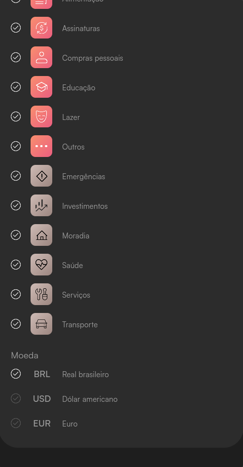

# App de Controle de Gastos Mensais

## Descrição

Este projeto é uma aplicação acadêmica desenvolvida para testar habilidades em Flutter. O tema foi pré-definido para simular um ambiente de trabalho real, focando no desenvolvimento de um aplicativo de controle de gastos mensais. A aplicação permite ao usuário registrar suas despesas, categorizá-las e visualizar relatórios.

## Funcionalidades

- Registro de despesas diárias com categorização.
- Relatórios visuais por categoria de gasto.
- Navegação simples entre telas de introdução, login, cadastro, controle de perfil, relatórios e configurações.
- Interface intuitiva para adicionar, editar e excluir despesas.

## Requisitos de Sistema

- **Flutter SDK**: >= 3.5.3
- **Dart SDK**
- Android Studio para desenvolvimento e execução
- Git para controle de versão

### Dependências

As principais dependências utilizadas no projeto são:

```yaml
dependencies:
  flutter:
    sdk: flutter
  cupertino_icons: ^1.0.8
  flutter_widget_from_html: ^0.15.2
  diacritic: ^0.1.3
```

Além disso, o projeto utiliza a família de fontes "Satoshi" customizada e ícones localizados na pasta `assets/imagens/`.

## Protótipo no Figma

O design e a estruturação da interface foram planejados no Figma. Você pode visualizar o protótipo acessando o seguinte link:

[Protótipo no Figma](https://www.figma.com/design/X2Ui5T9GUjMXExOc6XHjum/App---Fintech?node-id=0-1&t=BzDxUVpY5TRAKeJU-1)

## Paleta de Cores

A paleta de cores pré-definida para o projeto inclui as seguintes cores, das quais apenas as 3 primeiras (conforme o mínimo exigido) foram selecionadas:


- **#9C8680**
- **#EB5E7F**
- **#F98F6F**
- Além dessas três, foram utilizados tons de preto/cinza para harmonizar a estilização da aplicação.

## Printscreens do Aplicativo

Aqui estão alguns printscreens das telas do aplicativo:

1. **Tela de Introdução**


2. **Tela de Registro**


3. **Tela de Verificação de E-mail**


4. **Tela de Login**


5. **Tela de Redefinir Senha (E-mail)**


6. **Tela de Redefinir Senha (Confirmação)**


7. **Tela de Configurações (Categorias)**


8. **Tela de Configurações (Moeda)**



9. **Tela de Perfil**


10. **Redefinir Senha no Perfil**


11. **Selecionar Início do Período Mensal no Perfil**


12. **Relatório de Despesas por Categoria**


13. **Adicionar Nova Despesa**


14. **Despesas por Categoria (Assinaturas)**


15. **Editar Despesa por Categoria (Assinaturas)**


## Instalação

Para instalar o projeto localmente, siga os passos abaixo:

1. Clone o repositório:
   ```bash
   git clone <URL do repositório>
   ```
2. Acesse a pasta do projeto:
   ```bash
   cd flutter_application_1
   ```
3. Instale as dependências:
   ```bash
   flutter pub get
   ```

## Execução do Projeto

Após instalar as dependências, você pode executar o projeto com o seguinte comando no Android Studio ou diretamente no terminal:

```bash
flutter run
```

## Navegação entre Telas

O aplicativo é estruturado para navegar de maneira fluida entre várias telas, incluindo:

- **Tela de Introdução**: Uma tela inicial com imagem de fundo e botão para começar.
- **Tela de Login**: Permite que o usuário entre na aplicação com seu e-mail.
- **Tela de Registro**: Onde novos usuários podem criar uma conta.
- **Tela de Perfil**: Para visualizar e editar informações do usuário.
- **Tela de Relatórios**: Exibe relatórios detalhados dos gastos por categorias como alimentação, moradia, etc.
- **Tela de Configurações**: Onde o usuário pode ajustar suas preferências no aplicativo.
- **Tela de Adicionar Despesa**: Permite ao usuário adicionar uma nova despesa com detalhes como valor e categoria.

## Tecnologias Utilizadas

- **Flutter**: Framework para o desenvolvimento da interface do usuário.
- **Dart**: Linguagem de programação usada no desenvolvimento do aplicativo.

## Autores

- [Bredley Bauer](https://github.com/bredlxy)
- [Gabriel Coelho](https://github.com/coelhom12)
